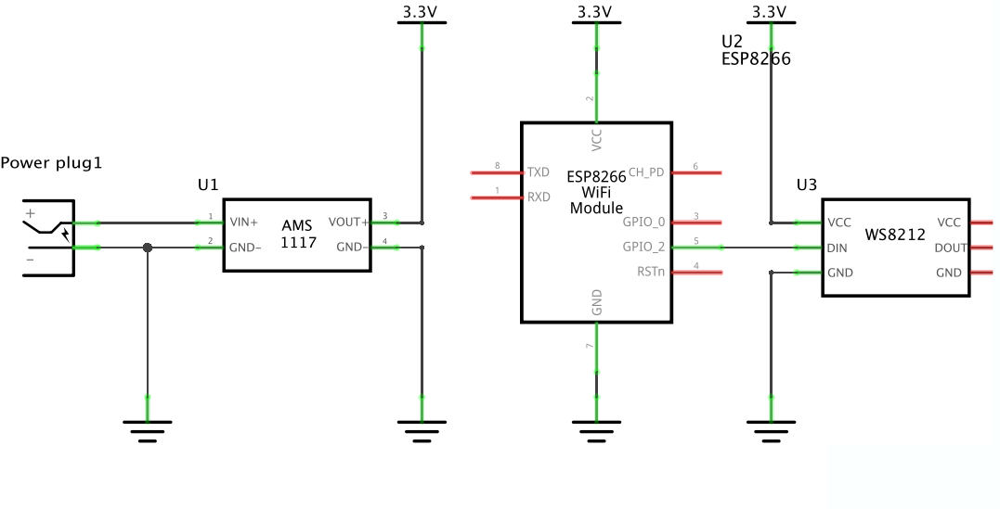

# Wordclock

**Another word clock**

This clock shows the time in words.

_Image: Wordclock Plate Model INES_

## Table of contents

- [List of materials](#bom)
- [Diagram](#diagram)

## List of materials

Here you will find the list of the required materials: [BOM](../Hardware/PCB/BOM.html)

## Diagram

Connect the modules as shown in the diagram:

