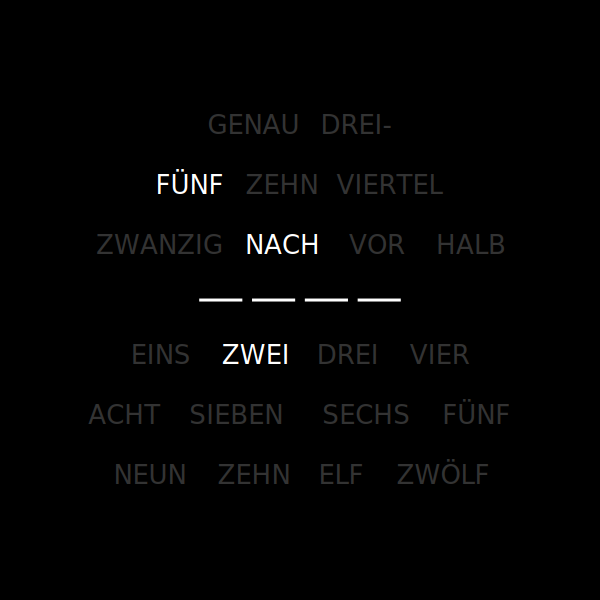
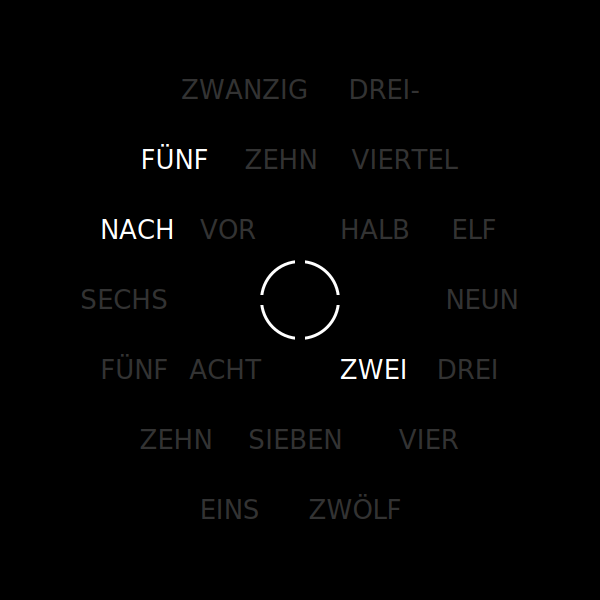
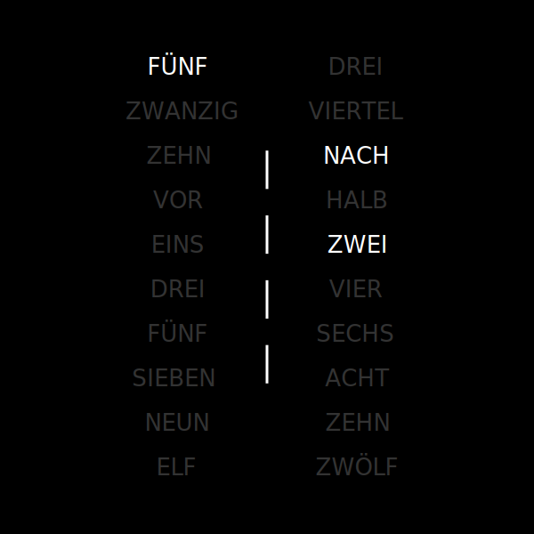

# Wordclock

**Another word clock**

This clock shows the time in words.

|  _Image: Wordclock Plate Model INES_ |  _Image: Wordclock Plate Model NINA_ |  _Image: Wordclock Plate Model MARIA_ |
|:---:|:---:|:---:|

## Table of contents

- [Establish network connection](#establish-network-connection)
- [Operating the clock](#operating-the-clock)
    - [Colors and brightness](#colors-and-brightness)
    - [Modes](#modes)
    - [Settings](#settings)
    	- [Switch on/off time](#switch-on-off-time)
    	- [Time zone/ daylight savings time](#time-zone-dst)
    	- [Languages](#languages)

## Establish network connection

For operating the clock and showing the time, it must be connected to the WLAN.

Proceed as follows:

- Connect the clock to the power supply.
- Connect to the clock from your PC, tablet or smartphone.
- Search the WLAN for "Wordclock" and connect to it.
- Enter the WLAN password "password", after connecting a captive portal will open. Via this portal you can enter the corresponding local WLAN and the corresponding password. The clock now restarts and connects to the set WLAN. The connection is now established.

_If no known WLAN can be found by the clock, it automatically switches back to access point mode and makes the captive portal available._

## Operating the clock

Various settings can be made via a web interface.

To make settings, connect to the clock via **[wordclock.local](http://wordclock.local)**.

### Colors and brightness

The color of the active (foreground color) and inactive (background color) words can be set via the web UI using a color picker. Thus, all additive colors are possible. In addition, a slider can be used to define the brightness from 0% to 100%.

An automatic brightness adjustment is currently not implemented.

### Modes

Via a group switch the following modes are available

- Normal (time display)
- Scanner (Knight Rider effect) or
- Test (all LEDs light up in sequence)

### Settings

#### Switch on/off time
The switch-on or switch-off time can be used to specify the time from which the clock switches to sleep mode and wakes up again.

This deactivates the display of the time during this period and the clock thus saves power.

#### Time zone/ daylight savings time

The clock obtains the correct time from the Network Time Protocol (NTP) via an Internet connection. To ensure that the correct time is displayed, the time zone corresponding to the location can be selected. In addition, the daylight savings time control can be switched on or off via a switch.

#### Languages

At the moment the front is only available in German (High German, Swabian, Bavarian, Saxon). The display of the language can be changed via the web interface.

The desired language can be set via a selection menu. Thus the time can be displayed, for example, in High German "VIERTEL VOR ZWEI" or Saxon "DREIVIERTEL ZWEI".
