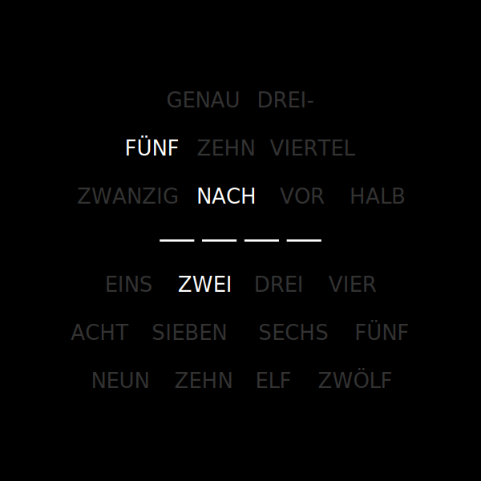
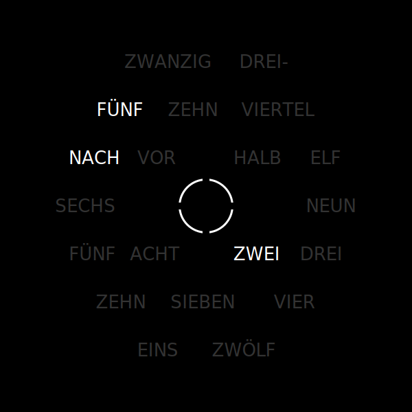
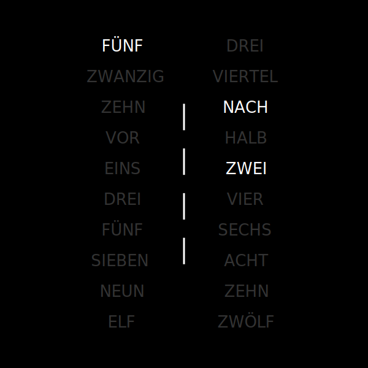

# Wordclock

**Another word clock**

This clock shows the time in words.

|  _Image: Wordclock Plate Model INES_ |  _Image: Wordclock Plate Model NINA_ |  _Image: Wordclock Plate Model MARIA_ |
|:---:|:---:|:---:|

A detailed [**build**](Documentation/BUILD.md) and [**operation**](Documentation/README.md) manual can be found in [**Documentation**](Documentation) folder.

## Requirements

The following is necessary to build this clock:

| amount | item |
|-:|:-|
| 1 | ESP8266 module |
| 24 or 25 | WS2812 RGB LED Strip (INES = 25; NINA = 24; MARIA = 24) |
| 1 | voltage regulator 3,3V |
| 1 | voltage regulator 5,0V |
| 1 | power supply |
| 1 | image frame 20x20cm (e.g. IKEA Ribba) |

## Libraries

not included:
* [Adafruit NeoPixel v1.3.5](https://github.com/adafruit/Adafruit_NeoPixel.git)
* [NTPClient v3.1.0](https://github.com/arduino-libraries/NTPClient.git)
* [WifiManager v0.15.0](https://github.com/tzapu/WiFiManager.git)

## Support me / Follow me

